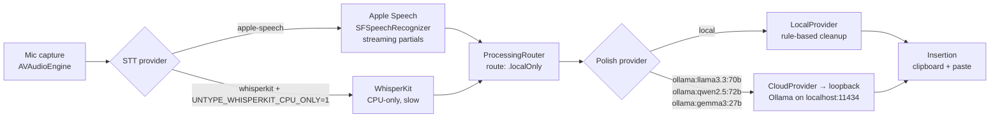
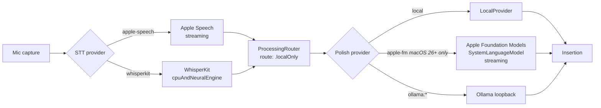
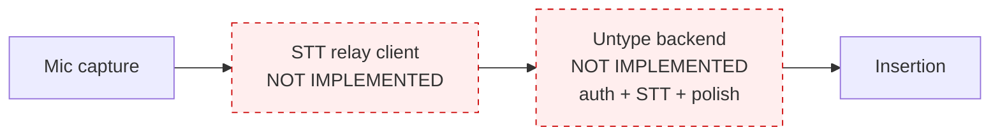
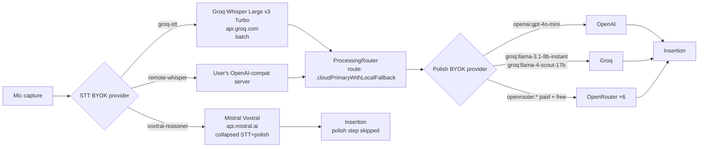
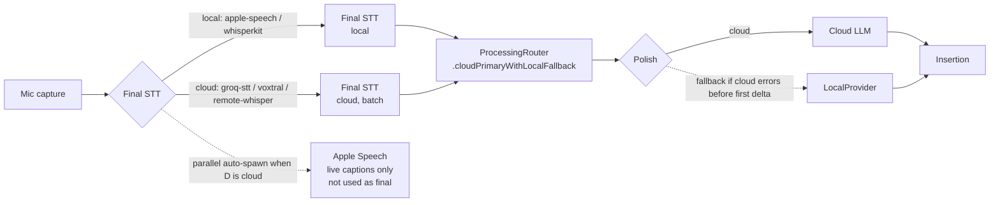

# Workflow Modes: Current State (snapshot 2026-05-08)

## TL;DR

Untype currently has **no first-class concept of a workflow mode**. Users pick one STT provider and one polish provider in Settings; the five modes below are *emergent combinations* of those choices. Four of the five are wired today (with caveats); the dedicated-server mode is essentially unimplemented, only its execution-mode enum case exists.

| # | Mode | Status |
|---|------|--------|
| 1 | Offline / Intel Mac | Wired, no Intel UX |
| 2 | Offline / Apple Silicon | Wired |
| 3 | Online / dedicated Untype server | **Not implemented** |
| 4 | Online / BYOK | Wired |
| 5 | Hybrid (local STT + cloud polish, etc.) | Wired but emergent |

## Cross-cutting facts (apply to all modes)

These are shared substrate; per-mode sections won't repeat them.

- **Provider selection**, `SettingsStore.sttProviderId` and `SettingsStore.polishingProviderId` (both `String?`, persisted in UserDefaults). See `Untype/Settings/SettingsStore.swift`.
- **Routing**, `ProcessingRoute` enum with three cases: `.localOnly`, `.cloudPrimaryWithLocalFallback`, `.localPrimaryWithCloudFallback`. Defined in `Sources/UntypeCore/Processing/LLMModels.swift`. Resolved at app launch by `AppRouterBuilder.build()`, see `Untype/App/AppRouterBuilder.swift:46-56`: tries to build the configured cloud provider, falls back to `.localOnly` if construction throws.
- **Execution-mode taxonomy**, `ExecutionMode` enum at `Sources/UntypeCore/Providers/ProviderDescriptor.swift:6` distinguishes `.local`, `.backendAPI`, `.byok`. **`.backendAPI` is reserved but unused**, no descriptor today registers as `.backendAPI`.
- **Reachability**, *not implemented*. No `NWPathMonitor`, no offline pill, no proactive retry queue. Cloud failures surface as `.cloudUnavailable(rawText:)` only after a request has already been attempted (see `Untype/Processing/ProcessingCoordinator+Errors.swift`).
- **Hardware detection**, *minimal*. The only branch that knows about Intel vs Apple Silicon is `WhisperKitService.swift:122-131`, which honours `UNTYPE_WHISPERKIT_CPU_ONLY=1` to force CPU-only compute. No `ProcessInfo`-based arch detection at app launch.
- **Key storage**, `KeychainStore` at service `"com.untype.app"`, per-host accounts: `openai.apiKey`, `groq.apiKey`, `openrouter.apiKey`, `mistral.apiKey`. Resolution order is env-var to Keychain (see `ProviderRegistry.swift`).
- **Implicit hybrid live captions**, when the configured *final* STT is cloud-backed (Groq STT, Voxtral, Remote Whisper), `TranscriberFactory.makeLive(paired:)` (`Untype/App/TranscriberFactory.swift:58-67`) auto-spawns a parallel Apple Speech instance to surface streaming partials. This is the closest the codebase has to a "Hybrid mode", but it's silent and emergent, not user-configured.

## Summary matrix

| Mode | STT options | Polish options | Default route | HW gate | Network gate | Key storage | Status |
|---|---|---|---|---|---|---|---|
| 1. Offline / Intel | Apple Speech, WhisperKit (CPU env-var) | Local rule-based, Ollama | `.localOnly` | `UNTYPE_WHISPERKIT_CPU_ONLY=1` |, | none | Wired, no Intel UX |
| 2. Offline / Apple Silicon | Apple Speech, WhisperKit (ANE default) | Local rule-based, **Apple FM** (macOS 26+), Ollama | `.localOnly` | `SystemLanguageModel.default.isAvailable` |, | none | Wired |
| 3. Online / dedicated server | (none) | (none) | (n/a) |, |, | (n/a) | **Not implemented** |
| 4. Online / BYOK | Groq STT, Voxtral, Remote Whisper(*) | OpenAI, Groq ×2, OpenRouter ×6 | `.cloudPrimaryWithLocalFallback` |, |, | Keychain + env vars | Wired |
| 5. Hybrid | Local STT + cloud polish, OR cloud STT + auto Apple Speech live captions | Any cloud | `.cloudPrimaryWithLocalFallback` |, |, | Keychain | Wired but emergent |

(*) `RemoteWhisperSTTDescriptor` is tagged `executionMode=.local` because the user runs the server. It's a local self-hosted STT in modes 1/2, or a hybrid component depending on where that server lives.

## Mode 1: Offline / Intel Mac



**What's wired**

- `Untype/App/TranscriberFactory.swift:29`, default STT provider is `apple-speech`.
- `Sources/UntypeCore/Transcription/WhisperKitService.swift:116-131`, `UNTYPE_WHISPERKIT_CPU_ONLY=1` forces all four CoreML compute units (mel, audio encoder, text decoder, prefill) to `.cpuOnly`. Comment notes that without this, WhisperKit crashes on Intel during the first decoder forward pass.
- `Sources/UntypeCore/Processing/PolishingRegistry.swift:19-35`, three Ollama models seeded in registry for local polish.
- `Untype/App/AppRouterBuilder.swift:55`, when no cloud provider builds, returns `.localOnly`.

**Gaps**

- **No automatic Intel detection.** User must know to set `UNTYPE_WHISPERKIT_CPU_ONLY=1` themselves; otherwise WhisperKit crashes silently on first decoder run.
- **No Intel-tuned default model.** Default WhisperKit model is `tiny` regardless of arch; on Intel CPUs even `tiny` can run real-time-factor > 1.
- **Apple FM unavailable on Intel** (Apple Intelligence requires Apple Silicon), correctly hidden by `AppleFMPolishingDescriptor.isAvailable` returning false.
- **Ollama setup is on the user.** Descriptors assume Ollama is running and the listed model is pulled, `PolishingRegistry.swift:15-18` comment confirms no liveness check; runtime failure surfaces as a networking error on first `polish()`.

**Recommended next slice**

Add a one-line arch detection at app launch:

```swift
#if arch(x86_64)
setenv("UNTYPE_WHISPERKIT_CPU_ONLY", "1", 0)
#endif
```

…and pin WhisperKit's default model to `tiny` on Intel. Roughly half a day of work; unblocks Intel users from a footgun.

## Mode 2: Offline / Apple Silicon



**What's wired**

- `Sources/UntypeCore/Transcription/WhisperKitService.swift:122-131`, without the env var, falls through to WhisperKit's own default (`.cpuAndNeuralEngine`).
- `Sources/UntypeCore/Processing/AppleFMPolishingAdapter.swift:25-34`, runtime gate via `SystemLanguageModel.default.isAvailable` plus compile-time `#if canImport(FoundationModels)`. Descriptor ID is `"apple-fm"` (line 17).
- `Untype/Settings/SettingsPolishingSection.swift`, Apple FM hidden in the picker if `isAvailable` returns false, so M-series users without Apple Intelligence enabled never see a broken option.
- `Sources/UntypeCore/Processing/PolishingRegistry.swift:68-85`, dispatcher routes the `apple-fm` descriptor to `AppleFMProvider()` directly (does **not** go through `ProviderRegistry.make`).

**Gaps**

- **No MLX, llama.cpp, or Core ML text inference.** Per `ProviderRegistry.swift:6-8`: "Local MLX-backed IDs are deliberately absent in this iteration." Users without Apple Intelligence have no on-device LLM option besides rule-based.
- **Apple FM only on macOS 26 + AI-eligible HW**, narrow installed base today.
- **No "Apple Silicon optimal" preset.** A new user with an M-series Mac and macOS 26 still has to compose `whisperkit` + `apple-fm` themselves.

**Recommended next slice**

Ship one MLX-backed local polish provider (e.g. Llama-3.1-8B-Instruct via `mlx-swift-examples`). Closes the gap for the M1–M3 + macOS 14/15 cohort and reuses the existing `LLMProvider` protocol. Larger effort (~1–2 weeks) but the highest-impact local-polish lever.

## Mode 3: Online / dedicated Untype server

> Aspirational diagram, nothing in this flow exists today.



**What's wired**

- *Only the enum case.* `ExecutionMode.backendAPI` exists at `Sources/UntypeCore/Providers/ProviderDescriptor.swift:14` and is documented as "Untype-hosted endpoint. Client holds a session token; server holds third-party API keys or runs OSS models on our infrastructure." **No descriptor in either registry tags itself as `.backendAPI`.**

**Blockers (in dependency order)**

1. No backend service, no API surface, no deployment.
2. No auth layer, no signup, no session-token issuance, no refresh.
3. No relay STT or relay polish provider on the client side. (The `CloudProvider` OpenAI-compat surface could be reused, but a relay also needs token-refresh semantics that BYOK doesn't have.)
4. No subscription/billing surface.
5. No `NWPathMonitor` to surface "you're offline; can't reach the relay" cleanly.

**Recommended next slice**

This is a product call, not an engineering call. If the answer is "yes, ship dedicated server soon," the smallest viable first slice is a **polish-only relay**:

- Stand up a tiny FastAPI / Cloudflare Workers endpoint that proxies to Anthropic with a server-held key.
- Add a `UntypeRelayProvider` that conforms to `LLMProvider` and reuses the OpenAI-compat shape `CloudProvider` already speaks.
- Issue short-lived JWT session tokens on signup; store in Keychain at `com.untype.app` / `untype.sessionToken`.
- Tag its descriptor `.backendAPI` so it shows up as a third execution-mode bucket in Settings.

This sidesteps the trickier path (relay STT, multipart audio upload + streaming response) while still validating the backend infrastructure end-to-end.

## Mode 4: Online / BYOK



**What's wired**

- 5 STT descriptors at `Sources/UntypeCore/Transcription/STTRegistry.swift:8-14` (apple-speech, whisperkit, groq-stt, remote-whisper, voxtral-reasoner). Three of those are BYOK paths.
- 9 cloud polish IDs at `Sources/UntypeCore/Processing/ProviderRegistry.swift:11-33`: 1 OpenAI, 2 Groq, 3 OpenRouter paid (gpt-4o-mini, llama-3.1-8b, llama-4-scout), 3 OpenRouter free (gpt-oss-120b, nemotron-3-super-120b, glm-4.5-air).
- `Sources/UntypeCore/Settings/KeychainStore.swift`, service `"com.untype.app"`, per-host accounts. Read-cache + write-invalidate to avoid repeated prompts.
- `Untype/Settings/SettingsSTTSection.swift:34-41`, passive warning under STT picker when chosen provider's API key is missing.
- `Untype/App/AppRouterBuilder.swift:46-56`, try-build cloud, set `.cloudPrimaryWithLocalFallback` if it succeeds, fall back to `.localOnly` if construction throws.
- Connection-time fallback in `Sources/UntypeCore/Processing/ProcessingRouter.swift`, if the primary stream errors before any `.delta` is emitted, the local provider takes over. After deltas start flowing, mid-stream errors propagate to the user.

**Gaps**

- **No reachability detection.** The user only learns they're offline after the polish call has timed out and surfaces `.cloudUnavailable(rawText:)`.
- **No pre-flight key check at hotkey-press.** Missing key only surfaces as a build failure at app launch (route to `.localOnly`); if the user adds a key after launch, it doesn't take effect until the next launch.
- **No mid-stream fallback.** Once polish starts streaming, a flaky network drops the user mid-output with no recovery beyond manual retry.
- **Voxtral asymmetry.** Voxtral conforms to both `STTStage` and `PolishingStage` but is registered only as STT. When selected, the separate polish stage is skipped, see `VoxtralReasonerAdapter.swift:37-40`. Intentional but invisible to the user.

**Recommended next slice**

- Add `NWPathMonitor` to `UntypeApp` and surface a small "offline" pill in the overlay top-right when not on a path. Auto-route to `.localOnly` while offline; restore primary route on reconnect.
- Re-build the router on Settings changes to a key, not just at launch.

## Mode 5: Hybrid

Two flavours exist today:

- **Hybrid A**, *Local STT + cloud polish*: e.g. Apple Speech transcribes; Groq llama-3.1-8b polishes. Falls back to local rule-based polish if Groq is down.
- **Hybrid B**, *Cloud STT + auto Apple Speech live captions*: when the configured final STT is cloud-backed (Groq STT, Voxtral, Remote Whisper), `TranscriberFactory.makeLive(paired:)` spawns a parallel Apple Speech instance just to surface live partials in the overlay while the cloud call resolves.



**What's wired**

- `Untype/App/TranscriberFactory.swift:58-67`, `makeLive(paired:)` short-circuits to `nil` when final is already Apple Speech, otherwise spawns parallel Apple Speech.
- `Untype/App/AppRouterBuilder.swift:46-51`, `.cloudPrimaryWithLocalFallback` is the default route whenever any cloud polish provider builds successfully.
- `Sources/UntypeCore/Voxtral/VoxtralReasonerAdapter.swift`, collapsed-pipeline proof: a single API call covers both STT and polish; the orchestrator detects dual conformance and skips the polish stage entirely. A third hybrid flavour conceptually ("monolith provider"), though transparently a single STT pick to the user.

**Gaps**

- **No user-facing "Hybrid" preset.** A new user has to compose it themselves: pick Apple Speech for STT, pick Groq for polish. Most users will accept whatever the defaults give them.
- **Live vs final transcript divergence.** When Hybrid B is active, the overlay shows Apple Speech partials and then replaces them with the cloud final. When the two disagree, there's no UI affordance explaining why.
- **No "what if I'm offline" hint.** Hybrid A degrades to local-fallback transparently, which is correct, but the user gets no signal that their cloud polish was unavailable.

**Recommended next slice**

Add a "Recommended" preset row at the top of Settings to Polish: **"Local mic + cloud polish (Apple Speech + Groq llama-3.1-8b-instant)"** that sets both `sttProviderId` and `polishingProviderId` in one click. Also surface a small chip in the overlay during Hybrid B that reads `live: Apple · final: Groq` so users learn the difference. ~1 day of work; converts an emergent behaviour into a deliberate one.

## Appendix

### Pointer table

| File | Role |
|---|---|
| `Sources/UntypeCore/Transcription/STTRegistry.swift` | All 5 STT descriptors and `makeStage(for:)` |
| `Sources/UntypeCore/Processing/PolishingRegistry.swift` | All polish descriptors + dispatcher |
| `Sources/UntypeCore/Processing/ProviderRegistry.swift` | `ProviderID` enum + cloud key resolution |
| `Sources/UntypeCore/Providers/ProviderDescriptor.swift` | `ExecutionMode`, `DeliveryMode`, `ProviderCapabilities` |
| `Sources/UntypeCore/Processing/ProcessingRouter.swift` | Connection-time fallback |
| `Sources/UntypeCore/Processing/LLMModels.swift` | `ProcessingRoute` enum |
| `Sources/UntypeCore/Transcription/WhisperKitService.swift` | Intel/ANE compute branch |
| `Sources/UntypeCore/Processing/AppleFMPolishingAdapter.swift` | macOS 26 availability gate + adapter |
| `Sources/UntypeCore/Processing/OllamaPolishingAdapter.swift` | Ollama descriptor + loopback adapter |
| `Sources/UntypeCore/Voxtral/VoxtralReasonerAdapter.swift` | Dual STT+Polish collapsed pipeline |
| `Untype/App/RecordingCoordinator.swift` | Recording lifecycle |
| `Untype/App/TranscriberFactory.swift` | STT instantiation + auto live-captions for hybrid |
| `Untype/App/AppRouterBuilder.swift` | Route selection at launch |
| `Untype/Processing/ProcessingCoordinator.swift` | State-machine bridge for polish |
| `Untype/Processing/ProcessingCoordinator+Errors.swift` | Cloud failure to AppError mapping |
| `Untype/Settings/SettingsStore.swift` | UserDefaults keys |
| `Untype/Settings/SettingsSTTSection.swift` | STT picker UI |
| `Untype/Settings/SettingsPolishingSection.swift` | Polish picker UI |
| `Untype/State/AppState.swift` | `Phase` and `AppError` enums |
| `Sources/UntypeCore/Settings/KeychainStore.swift` | API-key persistence |
| `Sources/UntypeCore/Processing/AppContext.swift` | Destination-app snapshot |

### Future-mode hooks (empty seams to reuse, not redesign)

- `ExecutionMode.backendAPI`, `Sources/UntypeCore/Providers/ProviderDescriptor.swift:14`. Reserve for the dedicated-server provider; UI can already filter by mode.
- `PipelineConfiguration` style/translation placeholders, typed `nil` slots for future stages that aren't STT or polish.
- `CloudProvider` OpenAI-compatible HTTP shape, a relay can speak this out of the box.
- `KeychainStore` per-account model, adding `untype.sessionToken` is a one-line change.
- `AppEvent.retryPolishRequested(rawText:)`, `Untype/State/AppEvent.swift`, already plumbed for offline-recovery retry; no need to reinvent.

---

*Snapshot taken 2026-05-08 against `main` at commit `5ec4446`. Verify file:line refs before acting on this doc, drift is expected over time.*
