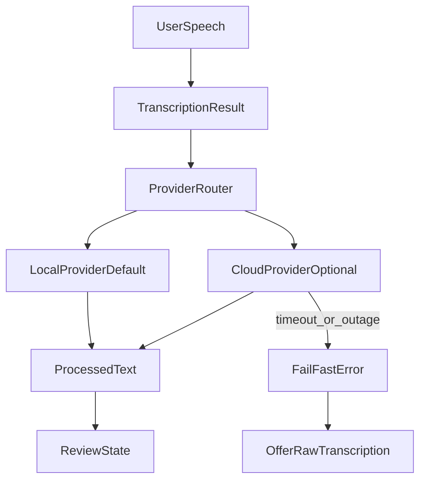

# Untype API Architecture (MVP Privacy-First)

## Purpose

Define a production-ready, privacy-first text-processing architecture for Untype where local processing is the MVP default and cloud providers are optional. This document specifies contracts, routing behavior, failure semantics, and a phased implementation path.

## Non-Goals (MVP)

- Multi-cloud orchestration across many providers
- Background queue processing of failed cloud requests
- Usage billing dashboards and deep analytics
- Certificate pinning or custom transport stacks

## Core Product Decisions

- Local processing is the default and required MVP path.
- Cloud processing is opt-in and disabled by default.
- Cloud outages use fail-fast UX: no deferred completion later.
- No background replay queue for cloud failures.
- Request IDs are mandatory to ignore stale async completions.

## Data Flow



## Processing Modes

### Local-First (Default)

- Route all text cleanup to local provider.
- Never require network connectivity.
- Show actionable local model readiness states (available, initializing, unavailable).

### Cloud-Optional

- User must explicitly enable cloud mode in settings.
- Cloud can be selected as:
  - `cloudPrimaryWithLocalFallback`: try cloud first, fallback to local if allowed and available.
  - `localPrimaryWithCloudFallback`: keep privacy-first behavior while allowing cloud when local unavailable.
- If cloud fails and fallback is not enabled, fail fast and offer raw transcription.

## Protocol Contracts (Swift)

```swift
import Foundation

enum ProcessingRoute: Sendable, Equatable {
    case localOnly
    case cloudPrimaryWithLocalFallback
    case localPrimaryWithCloudFallback
}

struct LLMRequest: Sendable, Equatable {
    let requestId: UUID
    let inputText: String
    let locale: String?
    let maxOutputTokens: Int?
}

struct LLMResponse: Sendable, Equatable {
    let requestId: UUID
    let outputText: String
    let providerName: String
    let modelName: String
    let latencyMs: Int
}

enum LLMError: Error, Sendable, Equatable {
    case cancelled
    case timeout
    case networkUnavailable
    case rateLimited(retryAfterSeconds: Int?)
    case authFailed
    case quotaExceeded
    case server(statusCode: Int)
    case invalidResponse
    case providerUnavailable(reason: String)
}

protocol LLMProvider: Sendable {
    var name: String { get }
    func process(_ request: LLMRequest) async throws -> LLMResponse
}

/// Concrete router — owns its providers, lives in Processing/.
/// No protocol needed for MVP; extract one only if a second router appears.
final class ProcessingRouter: Sendable {
    let localProvider: LLMProvider
    let cloudProvider: LLMProvider?

    func process(
        request: LLMRequest,
        route: ProcessingRoute
    ) async throws -> LLMResponse
}
```

## State and Settings Integration

- The user's selected `ProcessingRoute` is persisted in `Settings` and read by the router when `AppState` enters `.processing`.
- `ProcessingRouter` lives in `Processing/ProcessingRouter.swift`; models in `Processing/LLMModels.swift`; provider protocol in `Processing/LLMProvider.swift`.

## Provider Routing Rules

1. Generate `requestId` on each processing attempt and store it in `AppState`.
2. Route according to user-selected processing mode.
3. If route needs cloud but cloud provider is missing/unconfigured:
   - fallback to local only when route allows it;
   - otherwise return `providerUnavailable`.
4. On completion, apply result only if `response.requestId == currentProcessingRequestId`.
5. Ignore stale results silently to prevent state corruption.

## Fail-Fast Resilience Policy (Cloud)

### Timeouts and Retry

- Per-attempt timeout: 8 seconds.
- Total budget including retry: 18 seconds worst case (8s + ~1s backoff + 8s retry + jitter).
- One retry max for transient errors only:
  - `timeout`
  - `networkUnavailable`
  - `rateLimited`
  - `server(5xx)`
- Retry delay: exponential backoff with jitter (base 1s, jitter +/-300ms).
- No retries for:
  - `authFailed`
  - `quotaExceeded`
  - `invalidResponse`
  - `server(4xx except 429)`

### Cancellation

Cancel active processing task when:

- User presses `Esc`
- User starts a new recording
- Overlay dismisses
- App transitions out of active interaction flow

Map cancellation to `LLMError.cancelled` and return to a safe state without insertion.

### No Deferred Queueing

- Do not queue failed cloud requests for later replay.
- Do not auto-insert text after connectivity restoration.
- Preserve interactive consistency and avoid stale insertions.

## Error Taxonomy and UX Mapping

- `networkUnavailable` / `timeout` -> "Cloud unavailable. Press Enter to use raw text, Esc to cancel."
- `rateLimited` -> "Rate limited. Try again in a moment, or use raw text."
- `authFailed` -> "Cloud API key invalid. Check settings."
- `quotaExceeded` -> "Cloud quota exceeded. Use local processing or raw text."
- `providerUnavailable` -> "Selected provider unavailable. Switched to local when possible."
- `invalidResponse` / `server` -> "Processing failed. Use raw text or retry."

All error states keep explicit user agency:

- `Enter`: proceed with raw transcription
- `Esc`: dismiss and return to idle

## Security and Privacy Controls

### API Key Handling

- Store cloud API keys only in Keychain.
- Keep one key per provider namespace.
- Never persist keys in `UserDefaults`, logs, or files.

### Logging Hygiene

- Never log:
  - API keys
  - Full transcript text
  - Full provider payloads
- Allowed structured logs:
  - provider name
  - route type
  - latency bucket
  - normalized error category
  - retry count

### Data Minimization

- Process only text required for cleanup.
- Retain processed text in-memory for active session only.
- Clear temporary buffers after final insertion/cancel.

## MVP Implementation Phases

### Phase API-1: Contracts and Router

- Add request/response/error models.
- Add `LLMProvider` and `ProviderRouter` protocols.
- Add stale-response guard using `requestId`.

### Phase API-2: Local Provider Baseline

- Implement one local provider as default processing backend.
- Add availability checks and user-facing readiness state.
- Integrate with `AppState.processing` -> `reviewing`.

### Phase API-3: Optional Cloud Provider

- Implement one cloud provider behind settings opt-in.
- Add Keychain-backed key management.
- Add fail-fast timeout and retry policy.

### Phase API-4: Integration and UX Completion

- Wire error-to-state mappings in bar UI.
- Ensure `Enter`/`Esc` behavior is consistent across failures by wiring keybindings in `BarView` for error states.
- Add telemetry-safe diagnostics.

## Post-MVP Roadmap

- Additional cloud providers and richer routing policies.
- `supportsStreaming` on `LLMProvider` and streaming output for longer transformations.
- Local model manager UX (model install/update status).
- Prompt template system (`promptTemplateId` on requests) for multiple cleanup styles.
- Cost visibility and usage summaries.
- Advanced resilience patterns (circuit breaker, adaptive throttling).

## Test Matrix

### Unit

- Router chooses correct provider by route settings.
- Retries only transient cloud errors.
- No retry on auth/quota/invalid-response failures.
- Stale responses are ignored when request IDs mismatch.

### Integration

- End-to-end local-first success path.
- Cloud enabled with success and fallback behavior.
- Fail-fast outage path shows fallback options.
- Cancellation on `Esc` and new recording is deterministic.

### Regression Guards

- No queued replay after offline-to-online transition.
- No insertion from stale async completions.
- No sensitive data appears in logs.
